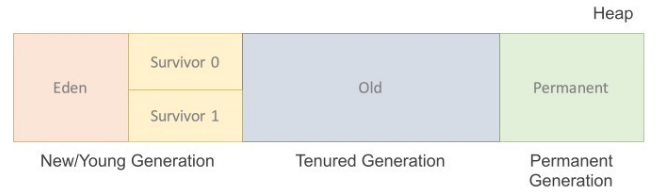
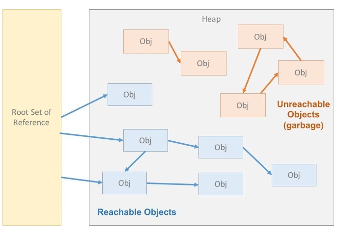

# Garbage Collection

### 1. What is GC?

* JVM의 메모리 관리 기법 중 하나로 시스템에서 동적으로 할당되었던 메모리 영역 중에서 필요 없어진 메모리 영역을 회수 및 관리하는 기법

### 2. GC 과정

<figure><figcaption>
GC
</figcaption></figure>

* JVM이 잠시 실행을 멈추고 GC를 실행하는 Thread를 제외한 나머지 Thread들의 작업을 중단 후, 사용하지 않는 메모리를 제거하고 작업 재개
* GC의 작업은 Young에 대한 Minor GC와 Old에 대한 Major GC로 구분

#### Minor GC

* 새로 생성된 대부분의 객체는 Eden 영역에 위치
* GC 과정을 거친 후 살아남은 객체는 Survivor 영역 중 하나로 위치
* 여러 번의 GC를 거치고 살아남은 객체는 일정 시간 참조되고 있다는 의미로, Old 영역으로 이동

#### Major GC

* Old 영역에 있는 객체들을 모두 검사하여 참조되지 않는 객체들을 한번에 삭제
* 이 작업은 실행이 오래 걸리고,  실행 중 작업을 진행중인 Thread를 제외한 나머지를 중단 (Stop-the-World)
* GC 작업 완료 후 다시 재개

### 3. GC 소멸 대상 선정 원리

<figure><figcaption>
Reachability
</figcaption></figure>

* Haep 내의 객체 중 Garbage를 찾아 회수
* Garbage란, 참조되고 있지 않은 객체를 뜻함
* 객체가 Garbage인지 판단하기 위해 Reachability 개념을 사용
* Reachability란, 어떤 Heap 영역에 위치한 객체가 유효한 참조가 있으면 Reachability, 없으면 Unreachability
* Root Set : 객체는 다른 객체를 참조하고, 또 다른 객체를 참조하기 때문에 참조 사슬이 형성되는데, 이 중 최초에 참조한 것
