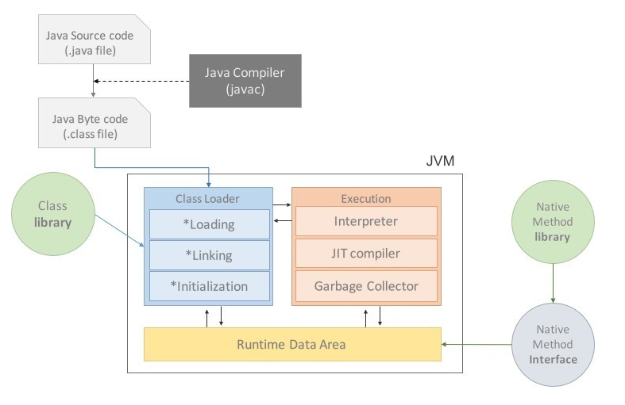

# JVM

## 1. What is JVM?

* JVM이란 Java Virtual Machine으로 자바 가상 머신
* 가상 머신이란, 프로그램을 실행하기 위한 물리적 머신과 유사한 머신을 SW로 구현한 것
* Stack 기반의 가상 머신

### 2. JVM의 역할

* Java로 작성된 모든 애플리케이션은 JVM 위에서만 동작
* Class Loader를 통해 Java Application을 읽어들여 Java API와 함께 실행하는 것
* Java와 OS 사이에서 중개자 역할을 수행하여 OS에 구애받지 않고 재사용을 가능하게 함
* 메모리 관리, 즉 Garbage Collection 수행

### 3. Why JVM?

* 메모리 효율성을 위해 메모리 구조를 알아야하고, 궁극적으로 한정된 메모리를 효율적으로 사용해 최적의 성능을 내기 위함

### 4. Java 프로그램 실행 과정

<figure><figcaption>
JVM
</figcaption></figure>

* 프로그램이 시작되면 실행될 프로그램의 메모리를 할당받아 용도에 따라 나누어 관리 (이 때 메모리는 Runtime Data Area에서 관리)
* 자바 컴파일러가 자바 소스코드를 읽어 자바 바이트코드로 변환
* Class Loader를 통해 class 파일들을 JVM으로 로딩
* 로딩된 class 파일들을 Execution Engine을 통해 해석
* 해석된 class 파일들은 Runtime Data Areas에 배치되어 실질적 수행 시 실행 (이 과정에서 필요에 따라 GC와 같은 관리 작업 수행)
