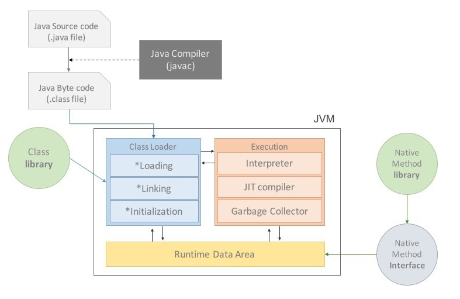

# JVM

## 1. What is JVM?

* JVM이란 Java Virtual Machine으로 자바 가상 머신
* 가상 머신이란, 프로그램을 실행하기 위한 물리적 머신과 유사한 머신을 SW로 구현한 것
* Stack 기반의 가상 머신

### 2. JVM의 역할

* Java로 작성된 모든 애플리케이션은 JVM 위에서만 동작
* Class Loader를 통해 Java Application을 읽어들여 Java API와 함께 실행하는 것
* Java와 OS 사이에서 중개자 역할을 수행하여 OS에 구애받지 않고 재사용을 가능하게 함
* 메모리 관리, 즉 Garbage Collection 수행

### 3. Why JVM?

* 메모리 효율성을 위해 메모리 구조를 알아야하고, 궁극적으로 한정된 메모리를 효율적으로 사용해 최적의 성능을 내기 위함

### 4. Java 프로그램 실행 과정

<figure><figcaption>
JVM
</figcaption></figure>

* 프로그램이 시작되면 실행될 프로그램의 메모리를 할당받아 용도에 따라 나누어 관리 (이 때 메모리는 Runtime Data Area에서 관리)
* 자바 컴파일러가 자바 소스코드를 읽어 자바 바이트코드로 변환
* Class Loader를 통해 class 파일들을 JVM으로 로딩
* 로딩된 class 파일들을 Execution Engine을 통해 해석
* 해석된 class 파일들은 Runtime Data Areas에 배치되어 실질적 수행 시 실행 (이 과정에서 필요에 따라 GC와 같은 관리 작업 수행)

### 5. 메모리 영역

<figure><figcaption>
메모리 영역
</figcaption></figure>

* Method / Heap / Stack 으로 구분되고, 데이터 타입에 따라 할당

#### Method

* 전역 변수 및 static 변수를 저장
* 프로그램 시작부터 종료까지 메모리에 존재

#### Heap

* new 키워드로 생성되는 객체(인스턴스), 배열 등이 저장
* GC에 의해 메모리 관리

#### Stack

* 지역 변수와 매개변수 데이터 값이 저장되는 공간
* 메소드가 호출될 때 메모리에 할당되고 종료되면 메모리 해제
* LIFO 구조를 가지고 변수에 새로운 데이터가 할당되면 이전 데이터 삭제

#### 각 메모리 영역 할당 시점

* Method : JVM이 동작해서 클래스가 로딩될 때 생성
* Heap : 런타임 시 할당
* Stack : 컴파일 타임 시 할당
* 컴파일 타임 : 소스코드가 기계어로 변환되어 실행 가능한 프로그램이 되는 과정
* 런타임 : 컴파일 타임 이후 프로그램이 실행되는 때

### 6. Static

* static 키워드를 사용한 변수나 메소드는 클래스가 메모리에 올라갈 때 자동으로 생성되며 클래스 로딩이 끝나면 바로 사용 가능
* 인스턴스 생성 없이 바로 사용 가능
* 모든 객체가 메모리를 공유
* GC 관리 영역 밖에 있기 때문에 프로그램 종료까지 메모리에 값이 유지된 채로 존재

#### static 사용 이유

* '전역 변수' 와 같은 개념을 통해 접근하는 것이 비용도 줄이고 효율을 높일 수 있음
* 인스턴스 생성 없이 바로 사용 가능하기 때문에 프로그램 내에서 공통으로 사용되는 데이터들을 관리할 때 사용

