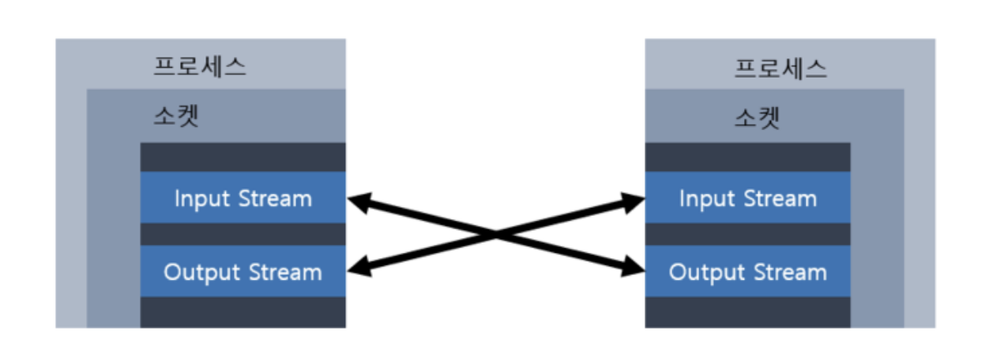

# Networking

### 1. 네트워킹

* 두 대 이상의 컴퓨터를 케이블로 연결하여 네트워크를 구성하는 것

#### 클라이언트 / 서버

* 서버 -> 서비스를 제공하는 컴퓨터
* 클라이언트 -> 서비스를 사용하는 컴퓨터
* 서버가 제공하는 서비스 종류에 따라, 파일 서버, 메일 서버, 어플리케이션 서버 등으로 나눌 수 있음

#### IP 주소

* 컴퓨터(호스트)를 구별하는데 사용되는 고유한 값으로, 인터넷에 연결된 모든 컴퓨터는 IP 주소를 가짐

#### URL(Uniform Resource Locator)

* 인터넷에 존재하는 여러 서버들이 제공하는 자원에 접근할 수 있는 주소
* '프로토콜://호스트명:포트번호/경로명/파일명?쿼리스트링#참조' 의 형태

> http://www.codechobo.com:80/sample/hello.html?referer=codechobo#index1 과 같다
>
> * 프로토콜 -> 자원에 접근하기 위해 서버와 통신하는데 사용되는 통신 규약
> * 호스트명 -> 자원을 제공하는 서버의 이름
> * 포트번호 -> 통신에 사용되는 서버의 포트번호
> * 경로명 -> 접근하려는 자원이 저장된 서버상의 위치
> * 파일명 -> 접근하려는 자원의 이름
> * 쿼리 -> URL에서 '?' 이후의 부분
> * 참조 -> URL에서 '#' 이후의 부분

```java
// URL 객체 생성
URL url = new URL("http://~ ");
URL url = new URL("www.~", "/sample/hello.html");
URL url = new URL("http", "www~", 80, "/sample~");
```

#### URLConnection

* 어플리케이션과 URL 간의 통신 연결을 나타내는 클래스의 최상위 클래스로 추상 클래스
* 상속받아 구현한 클래스로는 HttpURLConnection 과 JarURLConnection

### 2. 소켓 프로그래밍

* 소켓을 이용한 통신 프로그래밍
* 소켓이란, 프로세스간의 통신에 사용되는 양쪽 끝단을 의미
* 서로 멀리 떨어진 두 사람이 통신하기 위해서 전화기가 필요한 것처럼, 프로세스간의 통신을 위해 무언가가 필요하고 이것이 바로 소켓

#### TCP와 UDP

* 이기종 시스템간의 통신을 위한 표준 프로토콜로 프로토콜의 집합
* 둘다 TCP/IP 프로토콜에 포함되어 있음

<table><thead><tr><th width="137">항목</th><th>TCP</th><th>UDP</th></tr></thead><tbody><tr><td>연결 방식</td><td>연결기반(connection-oriented)<br>- 연결 후 통신(전화기)<br>- 1:1 통신방식</td><td>비연결기반(connectionless-oriented)<br>- 연결없이 통신(소포)<br>- 1:1, 1:n, n:n 통신방식</td></tr><tr><td>특징</td><td><p>데이터의 경계를 구분안함 (byte-stream)</p><p>신뢰성 있는 데이터 전송</p><p>- 데이터의 전송순서 보장</p><p>- 데이터 수신 여부 확인<br>(데이터 손실 시 재전송)</p><p>- 패킷 관리 필요 X</p><p>UDP보다 전송속도 느림</p></td><td><p>데이터의 경계 구분 (datagram)</p><p>신뢰성 없는 데이터 전송</p><p>- 데이터의 전송순서가 바뀔 수 있음</p><p>- 데이터 수신 여부 확인 X</p><p>(데이터 손실되어도 알 수 없음)</p><p>- 패킷 관리 필요</p><p>TCP보다 전송속도 빠름</p></td></tr><tr><td>관련 클래스</td><td>Socket<br>ServerSocket</td><td>DatagramSocket<br>DatagramPacket<br>MulticastSocket</td></tr></tbody></table>

#### TCP 소켓 프로그래밍

* 서버와 1대1 통신
* 서버 프로그램이 실행되어 클라이언트 프로그램의 연결요청을 기다리고 있어야 함
* 서버소켓은 포트와 결합되어 포트를 통해 원격 사용자의 연결요청을 기다리다가 요청이 올 때마다 새로운 소켓을 생성하여 상대편 소켓과 통신할 수 있도록 연결
* 포트(port)는 호스트(컴퓨터)가 외부와 통신을 하기 위한 통로
* 소켓들이 데이터를 주고받는 연결 통로는 입출력스트림


1. 서버 프로그램에서는 서버소켓을 사용해 서버 컴퓨터의 특정 포트에서 클라이언트의 연결요청을 처리할준비
2. 클라이언트 프로그램은 접속할 서버의 IP 주소와 포트 정보를 가지고 소켓을 생성해서 서버에 연결 요청
3. 서버소켓은 클라이언트의 연결요청을 받으면 서버에 새로운 소켓을 생성해서 클라이언트의 소켓과 연결되도록 함
4. 클라이언트의 소켓과 새로 생성된 서버의 소켓은 서버소켓과 관계없이 일대일 통신


<figure><figcaption><p>소켓 입출력스트림</p></figcaption></figure>

* 한 소켓의 입력 스트림은 상대편의 출력 스트림과 연결되고, 출력 스트림은 상대편의 입력 스트림과 연결


Socket

* 프로세스간의 통신 담당, InputStream / OutputStream을 가지고 있음
* 이 두 스트림을 통해 프로세스간의 통신이 이루어짐

ServerSocket

* 포트와 연결(bind)되어 외부의 연결요청을 기다림
* 요청이 들어오면 Socket을 생성해서 소켓간의 통신이 이루어지도록 함
* 한 포트에 하나의 ServerSocket만 연결 가능

