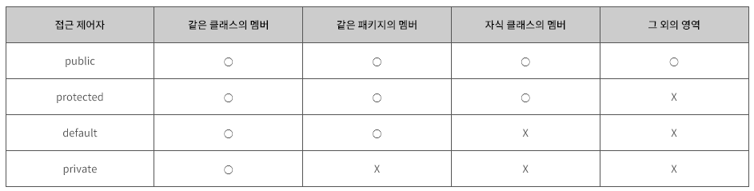

# Object-oriented Programming 2

### 1. 상속

* 기존의 클래스를 재사용하여 새로운 클래스를 작성하는 것
* 보다 적은 양의 코드로 새로운 클래스 작성, 코드를 공통적으로 관리 가능하므로 코드의 추가 및 변경이 매우 용이
* 키워드 'extends' 와 함께 사용

```java
class Child extends Parent {
    //...
}
```

* 이 때 Child를 자식 클래스, Parent를 부모 클래스라 함
* 생성자와 초기화 블럭은 상속되지 않음, 멤버만 사속
* 자식 클래스의 멤버 개수는 부모 클래스보다 항상 같거나 큼
* 단일 상속만 가능 (Java)

#### Object class

* 모든 클래스 상속계층도 최상위에 있는 부모 클래스

#### super

* 자식 클래스에서 부모 클래스로부터 상속 받은 멤버를 참조하는데 사용되는 참조 변수
* 부모 클래스의 멤버와 자식 클래스의 멤버가 중복 정의되어 서로 구별해야하는 경우에 사용

#### super()

* this() 와 마찬가지로 생성자
* this() 는 같은 클래스의 다른 생성자를 호출할 때 사용되지만, super() 는 부모 클래스의 생성자를 호출할 때 사용
* 자식 클래스 생성자 첫 줄에서 부모 클래스의 생성자를 호출해야 함 -> 자식 클래스 멤버가 부모 클래스 멤버를 사용할 수 있으므로 부모 클래스의 멤버들이 먼저 초기화 되어있어야 함
* 모든 클래스의 최상위 클래스인 Object 클래스 생성자 Object()까지 가서야 호출이 끝이 남

### 2. 제어자

* 접근 제어자 -> public, protected, default, private
* 그 외 -> static, final, abstract, native, transient, synchronized, volatile, strictfp

#### final

* 변수에 사용되면 값을 변경할 수 없는 상수가 됨
* 메서드에 사용하면 오버라이딩을 할 수 없음
* 클래스에 사용되면 자신을 확장하는 자식 클래스를 정의하지 못함

#### finally

* try-catch와 함께 사용되며, try-catch가 종료될 때 finally block이 항상 수행되므로 마무리 작업이 존재하는 경우 작성

#### finalize

* Object 클래스에 정의되어 있는 메서드로, GC에 의해 호출되며 절대 호출하면 안되는 메서드

#### abstract

* 메서드의 선언부만 작성하고 실제 수행 내용은 구현하지 않은 추상 메서드를 선언하는데 사용

#### public, protected, default, private

<figure><figcaption><p>Access Modifier</p></figcaption></figure>

* 멤버 또는 클래스에 사용되어, 해당하는 멤버 또는 클래스를 외부에서 접근하지 못하도록 제어하는 역할

#### 접근 제어자 사용 이유

* 외부로부터 데이터를 보호하기 위함
* 외부에는 불필요한, 내부적으로만 사용되는 부분을 감추기 위함

### 3. 다형성

* 여러가지 형태를 가질 수 있는 능력
* 부모 클래스 타입의 참조변수로 자식 클래스의 인스턴스를 참조할 수 있음

```java
// 기존 코드
class Tv {...}
class CaptionTv extends Tv {...}

Tv t = new Tv();
CaptionTv c = new CaptionTv();
 
// 다형성 적용
Tv t = new CaptionTv();
```

* 서로 상속관계에 있을 경우, 부모 클래스 타입의 참조변수로 자식 클래스의 인스턴스를 참조하는 것이 가능

```java
class Parent { 
    int x = 100;
    void method(){
        System.out.println("Parent Method");
    }
}
    
class Child extends Parent {
    int x = 200;
    void method(){
        System.out.println("Child Method");
    }
}
    
Parent p = new Child(); // 부모 클래스 참조 변수
Child c = new Child(); // 자식 클래스 참조 변수

System.out.println(p.x); // 부모 클래스 멤버 변수 사용
p.method();
System.out.println(c.x); // 자식 클래스 멤버 변수 사용
c.method();

--> 100
--> Child Method
--> 200
--> Child Method
```

* 멤버 변수가 부모 클래스와 자식 클래스에 중복으로 정의된 경우, 부모 타입의 참조변수를 사용했을 땐 부모 클래스에 선언된 멤버 변수가 사용되고, 자식 타입의 참조변수를 사용했을 땐 자식 클래스에 선언된 멤버 변수가 사용됨
* 메서드의 경우 인스턴스 타입인 Child의 method() 를 호출
* 인스턴스 변수인 x는 참조변수의 타입에 따라 달라짐

### 4. 추상 클래스

* 클래스를 설계도에 비유한다면, 추상 클래스는 미완성 설계도에 비유할 수 있음
* 미완성 메서드를 포함하고 있다는 의미
* 상속을 통해서 자식 클래스에 의해서만 완성 가능

### 5. 인터페이스

* 일종의 추상 클래스
* 추상 메서드를 갖지만 추상화 정도가 높아서 추상 메서드와 상수만을 멤버로 가짐
* 클래스와는 달리 여러 개의 인터페이스로부터 다중 상속이 가능
* 표준화 가능
* 독립적인 프로그래밍 가능
* 개발 시간 단축
* 관계 없는 클래스들에게 관계를 맺어 줄 수 있음

#### 추상 클래스와 인터페이스 공통점

* new 연산자로 인스턴스 생성 불가능
* 사용하기 위해선 자식 클래스에서 확장 및 구현 해야함

#### 추상 클래스와 인터페이스 차이점

* 추상 클래스 -> 다중 상속 불가능 / 상속 받는 클래스들의 공통 로직을 추상화시키고, 기능 확장을 위해 사용
* 인터페이스 -> 다중 상속 가능 / 구현하는 모든 클래스에 대해 특정 메소드가 반드시 존재하도록 강제

### 6. 내부 클래스

* 내부 클래스는 클래스 내에 선언된 클래스
* 코드의 복잡성을 줄일 수 있음
* 외부 클래스의 멤버들을 쉽게 접근 가능
