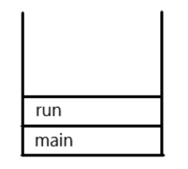
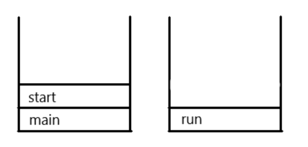
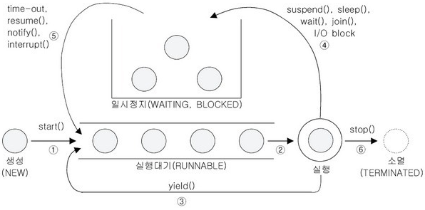

# Thread

### 1. 프로세스와 스레드

#### 프로세스

* 실행 중인 프로그램
* 프로그램을 실행하면 OS로부터 메모리를 할당 받아 프로세스가 됨
* 프로그램을 수행하는데 필요한 데이터와 메모리 등의 자원 그리고 스레드로 구성되어 있음

#### 스레드

* 프로세스의 자원을 이용해서 실제로 작업을 수행하는 것
* 모든 프로세스에는 최소한 하나 이상의 스레드가 존재하며, 둘 이상의 스레드를 가진 프로세스를 멀티스레드 프로세스라 함
* 간단히, 스레드를 프로세스라는 작업 공간에서 작업을 처리하는 일꾼이라고 생각하면 이해하기 쉬움

### 2. 멀티태스킹과 멀티스레딩

* 현재 사용하는 윈도우나 유닉스를 포함한 대부분의 OS는 멀티태스킹을 지원하므로 여러 개의 프로세스가 동시에 실행될 수 있음
* 멀티스레딩 -> 하나의 프로세스 내에서 여러 스레드가 동시에 작업을 수행하는 것
* CPU의 코어가 한 번에 단 하나의 작업만 수행할 수 있으므로, 실제 동시에 처리되는 작업의 개수는 코어의 개수와 일치
* 하지만 처리해야 하는 스레드의 수는 언제나 코어의 개수보다 훨씬 많기 때문에, 각 코어가 아주 짧은 시간 동안 여러 작업을 번갈아 수행함으로서 동시에 수행되는 것처럼 보이게 함

#### 멀티스레딩의 장단점

* CPU의 사용률을 향상시킴
* 자원을 보다 효율적으로 사용 가능
* 사용자에 대한 응답성 향상
* 작업이 분리되어 코드가 간결해짐
* 멀티스레드 프로세스는 여러 스레드가 같은 프로세스 내에서 자원을 공유하며 작업하기 때문에 발생할 수 있는 동기화, 교착 상태와 같은 문제를 고려해야함
* 교착 상태 -> 두 스레드가 자원을 점유한 상태에서 서로 상대편이 점유한 자원을 사용하려고 기다리느라 진행이 멈춰 있는 상태

### 3. 스레드의 구현과 실행

* Thread 클래스 상속 / Runnable 인터페이스 구현 -> 일반적으로 Runnable 인터페이스 구현이 일반적
* 스레드를 구현한다는 것은, 그저 스레드를 통해 작업하고자 하는 내용으로 run()의 내용을 채우는 것

```java
// Thread 클래스 상속
class MyThread extends Thread {
    public void run() { /* 작업내용 */ } // Thread 클래스의 run() 오버라이딩
}
    
// Runnable 인터페이스 구현
class MyThread implements Runnable {
    public void run() { /* 작업내용 */ } // Runnable 인터페이스의 run() 구현
}

// Thread
class ThreadEx1_1 extends Thread {
    public void run() {
        for(int i=0; i<5; i++) {
            System.out.println(getName()); // 조상인 Thread의 getName() 호출
        }
    }
}

//Runnable
class ThreadEx1_2 implements Runnable {
    public void run() {
        for(int i=0; i<5; i++) {
            // Thread.currentThread() - 현재 실행중인 Thread를 반환
            System.out.println(Thread.currentThread().getName());
        }
    }
}
```

### 4. start()와 run()

* 스레드를 실행시킬 때 start() 호출
* main 메서드에서 run()을 호출하는 것은 생성된 스레드를 실행시키는 것이 아니라 단순히 클래스에 선언된 메서드를 호출하는 것
* start()는 새로운 스레드가 작업을 실행하는데 필요한 호출스택(call stack)을 생성한 다음에 run()을 호출해서, 생성된 호출스택에 run()이 첫번째로 올라가게 함
* 모든 스레드는 독립적인 작업 수행을 위해 자신만의 호출스택을 필요로 하기 때문에, 새로운 스레드를 생성하고 실행시킬 때마다 새로운 호출스택이 생성되고 스레드가 종료되면 사용된 호출스택은 소멸
* 중요한 점은 호출스택의 최상위에 있어도 먼저 실행되는 것이 아니라, 스케줄러에 따라 실행됨

<figure><figcaption><p>run() 호출</p></figcaption></figure>

<figure><figcaption><p>start() 호출</p></figcaption></figure>

### 5. 싱글스레드와 멀티스레드

* 싱글스레드는 한 작업을 마친 후에 다른 작업을 시작하지만, 멀티스레드는 짧은 시간동안 2개의 스레드가 번갈아 작업을 수행하며 동시에 처리되는 것과 같이 느끼게 함
* 멀티스레드로 작업한 시간이 싱글스레드보다 오래 걸리는데, 스레드 간의 작업 전환(컨텍스트 스위칭) 때문
* 컨텍스트 스위칭 -> 프로세스 또는 스레드 간의 작업 전환
* 작업 전환 시에는 현재 진행 중인 작업의 상태를 저장하고 읽어오는 시간이 소요됨

### 6.  스레드의 우선순위

* 스레드는 우선순위라는 속성(멤버변수)를 가지고 있는데, 이 값에 따라 스레드가 얻는 실행시간이 달라짐
* void setPriority(int newPriority) / int getPriority()
* 우선순위의 범위는 1\~10이고, 숫자가 높을수록 우선순위가 높음
* 스레드의 우선순위는 스레드를 생성한 스레드로부터 상속받음 ex) main메서드를 수행하는 스레드는 우선순위가 5이므로 main메서드 내에서 생성하는 스레드의 우선순위는 자동으로 5가 됨

```java
// 스레드 실행 전에만 우선순위를 변경할 수 있음
public class ThreadEx1 {
    public static void main(String[] args) {
        ThreadEx7_1 th1 = new ThreadEx7_1();
        ThreadEx7_2 th2 = new ThreadEx7_2();

        th2.setPriority(7);

        System.out.println("Priority of th1(-) : " + th1.getPriority());
        System.out.println("Priority of th2(|) : " + th2.getPriority());
        th1.start();
        th2.start();
    }
}
```

### 7. 스레드 그룹

* 서로 관련된 스레드를 그룹으로 다루기 위한 것
* ThreadGroup을 사용해서 생성 가능
* 스레드 그룹을 지정하지 않은 스레드는 자동적으로 main 스레드 그룹에 속함

### 8. 데몬 스레드

* 다른 일반 스레드의 작업을 돕는 보조적인 역할을 수행하는 스레드
* 일반 스레드가 모두 종료되면 데몬 스레드는 존재의 의미가 없으므로 강제적으로 자동 종료

### 9. 스레드의 실행제어

<figure><figcaption><p>스레드의 상태</p></figcaption></figure>

* 스레드를 생성하고 start()를 호출하면 실행 대기열에 저장되어 자신의 차례가 될 때까지 기다려야 하고, 큐와 같은 구조로 먼저 실행 대기열에 들어온 스레드가 먼저 실행
* 실행 대기 상태에 있다가 자신 차례가 되면 실행 상태가 됨
* 주어진 실행 시간이 다되거나 yield()를 만나면 다시 실행 대기 상태가 되고 다음 스레드의 실행 상태가 됨
* 실행 중에 suspend(), sleep(), wait(), join(), I/O block에 의해 일시정지 상태가 될 수 있음
* 지정된 일시정지 시간이 다되거나(time-out), notify(), resume(), interrupt()가 호출되면 다시 실행대기열에 저장되어 차례를 기다림
* 실행을 모두 마치거나 stop()이 호출되면 스레드 소멸

#### 용어

* sleep() -> 일정 시간동안 스레드를 멈추게 함
* interrupt()  -> 스레드의 작업을 취소 (종료가 아니라 멈추라고 요청하는 것)
* suspend() -> sleep()처럼 스레드를 멈추게 함
* resume() -> suspend()에 의해 정지된 스레드를 실행 대기 상태로 만듬
* stop() -> 호출되는 즉시 스레드가 종료
* suspend()와 stop()은 교착상태(deadlock)을 일으키기 쉽게 작성되어 있어 사용이 권장되지 않음
* yield() -> 자신에게 주어진 실행시간을 다음 차례의 스레드에게 양보
* join() -> 자신이 하던 작업을 잠시 멈추고 다른 스레드가 지정된 시간동안 작업을 수행하도록 함

### 10. 스레드의 동기화

* 싱글 스레드의 경우 프로세스 내에서 단 하나의 스레드만 작업하기 때문에 문제가 없지만, 멀티 스레드 프로세스의 경우 여러 스레드가 프로세스 내의 자원을 공유해서 작업하므로 서로 영향을 주게 됨
* 스레드 A가 작업하던 중에 다른 스레드 B에게 제어권이 넘어갔을 때, 스레드 A가 작업하던 공유 데이터를 B가 임의로 변경하면, A가 다시 넘겨받아 작업을 마쳤을 때 의도와 다른 결과를 얻을 수 있음
* 따라서, 한 스레드가 특정 작업을 마치기 전까지 다른 스레드에 의해 방해받지 않도록 하는 것이 필요
* 여기서 등장한 개념이 **임계 영역(critical section)**과 **잠금(lock)**
* 공유 데이터를 사용하는 코드 영역을 임계 영역으로 지정하고, 공유 데이터(객체)가 가지고 있는 lock을 획득한 단 하나의 스레드만 이 영역 내의 코드를 수행할 수 있게 함
* **스레드의 동기화** -> 한 스레드가 진행 중인 작업을 다른 스레드가 간섭하지 못하도록 막는 것

### synchronized를 이용한 동기화

* 임계 영역을 설정하는 것에 사용
* lock의 획득과 반납이 자동적으로 이루어지므로, 임계 영역만 지정해주면 됨

```java
// 1. 메서드 전체를 임계 영역으로 지정
public synchronized void calcSum() { ... }

// 2. 특정 영역을 임계 영역으로 지정
synchronized(객체의 참조변수) { ... }
```

